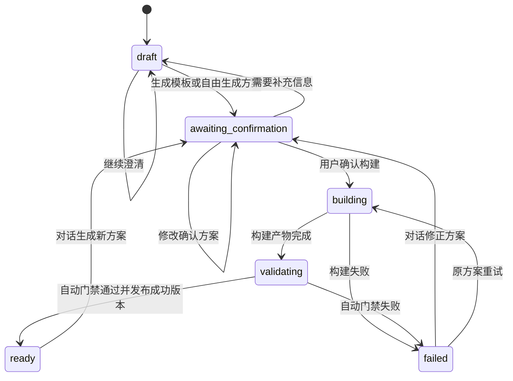
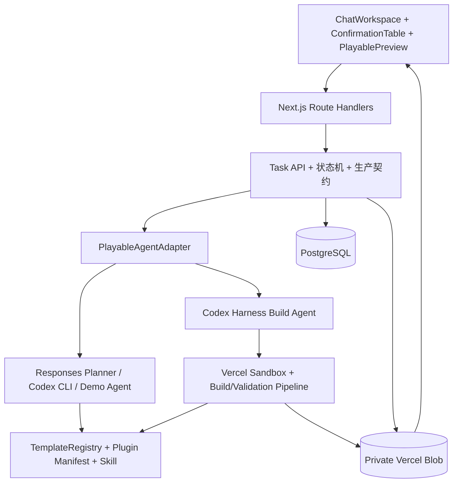

# Playable Agent POC：当前能力、用户路径与演进路线

> 文档基线：2026-09-08
> 说明：本文以当前仓库中的实际代码为准，区分“已经实现”“部分实现”和“后续规划”，不把飞书设计方案中的远期能力视为现状。

## 1. 当前产品定位

当前 POC 是一个面向 C6 麻将配对类试玩广告的生产工作台。用户通过对话描述需求，系统将需求路由到已注册的 Playable Plugin，生成结构化确认方案，并在隔离环境中构建和验证单文件 HTML。自动门禁通过后，系统保存新的成功版本，用户可以立即试玩、下载或继续修改。

当前主链路如下：

```text
需求输入
  → 多轮澄清
  → Plugin 精确/近似路由或自由生成
  → 完整配置确认
  → 素材准备
  → 隔离构建
  → 自动质量门禁
  → 保存成功版本
  → 试玩、下载或继续修改
```

目前只注册了一个版本化 Plugin：`mahjong-pair-match-playable@1.1.0`，运行时版本为 `2`，支持 AppLovin 单 HTML 交付。

## 2. 已实现能力总览

### 2.1 用户、会话和凭证

- 支持 GitHub/Vercel 登录体系，并基于用户身份隔离任务、素材和产物。
- 采用 BYOK 模式，每位用户提供自己的 OpenAI API Key。
- API Key 会先验证是否能够访问固定模型 `gpt-5.6-sol`，并区分无效 Key、模型无权限、额度不足、限流和网络失败。
- API Key 使用 JWE 加密后保存在服务端管理的 Cookie 中，有效期 2 小时。
- Cookie 使用 `HttpOnly`、`SameSite=Strict`，生产环境增加 `Secure`。
- API Key 不写入数据库、浏览器持久存储、用户可见日志或最终产物。
- 构建前后会扫描确认配置和 HTML，阻止凭证进入产物。

### 2.2 任务和对话

- 支持创建任务、查看任务列表、打开历史任务和恢复已有对话。
- 支持多轮需求澄清，Agent 可以请求文本、单选、多选、链接或审批输入。
- 对话响应使用 NDJSON 流式返回，前端可以显示 Domain Tool 执行、动态提问、确认方案或错误。
- 服务端持久化用户消息、Agent 结构化回复、实时 Requirement Brief 和任务事件。
- 构建期间前端每 2 秒轮询任务事件和最新状态。
- 用户可以中止当前 Agent 响应；当前只会中止活动中的 Agent 调用，尚未形成完整的持久化任务取消流程。

### 2.3 Plugin 路由和玩法模板

- 使用 `plugin.json` 声明 Plugin ID、Plugin 版本、运行时版本、支持模式、素材槽、构建命令、验证命令、交付网络和包体上限。
- Plugin 清单在加载时通过 Zod 严格校验，避免错误配置进入运行时。
- 支持三类路由结果：
  - `exact`：现有模式可以准确覆盖需求。
  - `approximate`：可以使用现有模式，但必须显示置信度和已知差异。
  - `freeform`：现有模式无法表达核心玩法时，选择最接近的模式作为工作区脚手架，由大模型直接生成 HTML。
- 自由生成仍需先确认玩法和差异，并通过通用安全、离线、交互、静音、商店跳转和包体门禁；系统不会创建新增 Plugin 需求单。
- 当前支持四种玩法模式：

| 模式 ID            | 用户名称 | 已实现核心行为                               |
| ------------------ | -------- | -------------------------------------------- |
| `center_collision` | 中心碰撞 | 两张相同牌向中心运动、碰撞、破碎并计分       |
| `top_rack`         | 上方牌架 | 可见牌进入四槽牌架，配对清除；牌架填满后回退 |
| `gravity_fill`     | 下落补位 | 网格配对消除，列下落并从上方补位             |
| `perspective_3d`   | 3D 纵深  | 选择立体牌墙暴露顶面，移除后揭示下层         |

### 2.4 结构化生产配置

- Agent 必须输出通过 Schema 校验的确认方案，不能直接用自由文本启动构建。
- 确认内容覆盖玩法、素材策略、文案、商店地址和投放约束。
- 用户可以在确认表中修改文案、商店地址和各素材槽的来源策略。
- 商店地址必须是绝对 HTTPS URL。
- 当前交付参数固定为 AppLovin、逻辑画布 `360 × 640`、响应式展示、单文件 HTML、包体小于 5 MiB。
- 构建时会将确认方案投影为五组生产配置：

| 配置组   | 内容                                            |
| -------- | ----------------------------------------------- |
| `core`   | Plugin/运行时版本、玩法模式、玩法描述、路由结论 |
| `theme`  | 从各素材处理要求汇总出的美术方向                |
| `assets` | 五类素材槽的来源状态和处理要求                  |
| `ad`     | 投放网络、画布、包体、商店地址和响应式约束      |
| `copy`   | 标题、CTA、免责声明和语言                       |

- 为兼容升级前的历史任务，旧确认记录缺少路由信息时会按精确匹配默认值读取；新 Agent 输出仍必须显式提供路由结论。

### 2.5 素材管理和本地上传

当前有五个标准素材槽：

| 素材槽             | 用途            | 当前可选状态               |
| ------------------ | --------------- | -------------------------- |
| `tileFaces`        | 麻将牌面        | 用户上传、内置默认、待上传 |
| `backgroundBoard`  | 背景和棋盘      | 用户上传、内置默认、待上传 |
| `animationEffects` | 动画和特效      | 用户上传、内置默认、待上传 |
| `audio`            | BGM、音效或语音 | 用户上传、内置默认、待上传 |
| `endCard`          | 结束卡          | 用户上传、内置默认、待上传 |

已实现的素材能力包括：

- 用户上传文件的任务归属校验、MIME 校验、4 MiB 单文件限制和私有存储。
- 首页输入框支持一次选择最多 6 个参考图片或视频；允许 PNG、JPEG、WebP、GIF、MP4 和 WebM，也允许只上传参考素材后直接创建任务。
- 最终确认方案支持两类本地上传：五个生产资源槽按槽位选择文件，以及独立的参考图片/参考视频附件。
- 每个槽位采用独立 MIME 白名单：图片槽只接受图片、音频槽只接受音频、参考视频槽只接受 MP4/WebM，避免把视频误当成棋盘或结束卡素材。
- 确认表保留 AI 生成/AI 配音按钮作为后续能力入口，但按钮置灰并明确标注“暂不支持”。
- Agent 当前只会推荐内置默认或本地上传，不会生成 `待生成` 方案。
- 服务端同时拒绝包含 `待生成` 的确认和构建，避免绕过前端触发 AI 生产。
- 仓库保留 `gpt-image-2` 和 `gpt-4o-mini-tts` 的媒体生成实现作为后续技术预研，但当前用户路径不可达。
- 首页参考附件在进入任务前上传，任务页重新打开后仍会展示；Agent 只收到脱敏后的文件名、类型、大小等元数据，不会读取或声称已理解视频画面。
- 构建时只复制用户明确分配到五个生产资源槽的素材字节，不把参考附件、Blob 地址或用户存储路径带入最终产物。
- 生成素材来源清单，记录 Plugin 版本、素材来源、处理说明、文件名和产物内工作路径。
- 最终 HTML 会内联素材，不依赖线上 CDN。

当前模板对生产素材的实际消费范围仍有限：牌面上传图会复用于所有牌面，背景素材会替换主背景，音频素材会替换 BGM，结束卡图片会替换结束卡背景；`animationEffects` 尚未完整接入运行时表现。参考图片和视频当前仅作为需求附件保存和展示，不会进入构建素材清单，也不会自动解析内容。

### 2.6 Agent 与隔离构建

- 业务层只依赖 `PlayableAgentAdapter`，将对话、任务和构建领域逻辑与具体 Agent SDK 隔离。
- 线上需求整理使用 AI SDK 的 OpenAI Responses Provider 和固定模型 `gpt-5.6-sol`，直接返回结构化流；此阶段不创建 Sandbox。
- 需求整理 Agent 先根据完整对话判断意图：咨询、闲聊和使用帮助通过 `respond_to_user` 直接回复，不修改 Brief 也不评估路由；游戏需求才使用应用层 Domain Tool 计划更新 Brief、检查素材、读取 Plugin 能力、验证实现路由并决定继续提问或提交方案；不开放 Bash。
- 用户确认方案后，构建 Agent 才通过 Codex Harness 在任务工作区内使用 Bash，不能修改仓库中的 Plugin 主副本。
- 每次构建创建独立 Vercel Sandbox，运行时为 Node.js 24。
- Sandbox 中包含：
  - `skill-master`：复制后的只读 Plugin/Skill 主副本。
  - `work`：当前任务可写工作区。
  - `confirmed-config.json`：用户确认配置。
  - `asset-manifest.json`：素材映射和来源。
  - `user-assets/`：当前任务实际拥有的素材。
- 构建前后都会逐文件比较 `skill-master`，发现篡改立即失败。
- 构建和验证命令来自 Plugin 清单，避免业务代码与模板命令重复配置。
- Sandbox 无论成功或失败都会尝试销毁。

### 2.7 自动质量门禁

只有所有自动门禁通过，构建结果才能发布为新的成功版本。

当前自动检查包括：

- 确认配置和 Agent 输出的严格 Schema 校验。
- 四种玩法的可运行行为测试。
- 错误配对不能改变进度。
- 正确配对、计分、牌架回退、下层揭示和结束卡显示等模式行为。
- 初始音频必须处于静音且未解锁状态。
- 首次有效玩法交互前，CTA 不能打开商店。
- 父页面静音消息必须校验来源和数据类型。
- HTML 必须包含 `window.__PLAYABLE__` 运行时契约。
- HTML 必须包含响应式 viewport 和 Canvas。
- HTML 包体必须严格小于 Plugin 声明的 5 MiB 上限。
- HTML 中不允许 HTTP、协议相对或本地相对资源引用；资源必须使用 `data:`、`blob:` 或页内锚点。
- HTML 和配置中不能包含用户 API Key 或已知凭证模式。

系统会生成结构化验证报告，记录 Plugin/运行时版本、包体大小以及每一个门禁的通过/失败状态。

### 2.8 Preview、版本和交付

- 自动门禁通过后，任务直接进入 `ready`，可以立即试玩和下载。
- Preview 支持竖屏、横屏容器切换、刷新和静音控制，默认保持静音。
- Preview 使用 `iframe sandbox="allow-scripts"`，不授予同源、表单和顶层导航权限。
- 服务端同时设置严格 CSP：禁止网络连接、外部资源、表单提交和父页面越权访问。
- 每次构建都有独立记录；成功构建按时间编号为 v1、v2、v3，并可切换预览和下载。
- 新构建失败时不会清空或替换上一个成功 Preview。
- 任务成功或失败后仍可继续自然语言对话；新方案确认后创建下一次构建。
- 只有任务所有者才能查看版本、预览和下载交付物。
- 当前交付四件套：

| 文件                     | 作用                       |
| ------------------------ | -------------------------- |
| `playable.html`          | 可离线运行的单文件试玩广告 |
| `production-config.json` | 完整生产配置和版本信息     |
| `asset-manifest.json`    | 素材来源、映射和文件清单   |
| `validation-report.json` | 自动质量门禁结果           |

### 2.9 三种运行模式

| 模式            | Agent                         | 数据与产物                    | 构建环境       | 适用场景                   |
| --------------- | ----------------------------- | ----------------------------- | -------------- | -------------------------- |
| 正常模式        | Responses API 规划 + Codex Harness 构建 | PostgreSQL + 私有 Vercel Blob | 确认构建后创建 Vercel Sandbox | 部署环境和真实用户         |
| 本地 Codex 模式 | 本机 Codex CLI                | 真实 PostgreSQL + 私有 Blob   | Vercel Sandbox | 无 OAuth 的真实联调        |
| 本地 Demo 模式  | 确定性本地 Agent              | 内存任务库 + 内存产物库       | 本地临时目录   | 无外部凭证的 UI 和流程演示 |

本地 Demo 会执行真实的四模式构建脚本和行为检查，但 Agent 回复是规则化生成，进程重启后数据会清空。

## 3. 用户交互路径

### 3.1 标准成功路径

1. 用户登录 Playable Studio。
2. 用户配置自己的 OpenAI API Key；服务端验证 Key 和模型访问能力。
3. 用户在首页输入玩法、美术主题或素材需求，可同时添加参考图片/视频；系统先创建任务并上传参考附件，再进入工作台。
4. 系统进入任务工作台：左侧是对话和配置，右侧是 Preview。
5. Agent 根据历史对话、持久化 Brief、已上传素材和 Plugin 能力，自主调用 Domain Tools 整理需求和验证实现路线。
6. 信息不足时，Agent 动态请求文本、单选、多选、链接或审批输入；用户继续补充。
7. 信息完整后，Agent 选择最合适的生产路径，并返回：
   - 精确匹配、近似匹配或自由生成。
   - 路由置信度。
   - 近似或自由生成方案与模板的差异。
   - 完整确认配置。
8. 用户检查并修改确认表，选择每个生产素材槽使用内置默认或本地上传，也可以补充参考图片/视频；AI 生成按钮置灰。
9. 用户点击本地上传并选择文件，服务端完成归属、逐槽类型和大小校验；参考附件仅保存元数据供 Agent 识别，不进入最终产物。
10. 用户点击确认构建；如果存在待上传/待生成素材、无效 URL 或缺少所需 API Key，系统停留在确认阶段并提示处理。
11. 服务端认领当前版本并准备用户上传素材。
12. 系统创建隔离 Sandbox，复制只读 Plugin、确认配置和任务素材。
13. Codex 在任务工作区执行构建，随后运行行为和安全检查。
14. 全部门禁通过后，系统保存四件套产物和成功版本记录，任务直接进入 `ready`。
15. 用户在 Preview 中切换版本、横竖屏、刷新、控制静音，并检查视觉、节奏、易理解性和品牌一致性。
16. 用户可以立即下载 HTML、生产配置、素材清单和验证报告，也可以继续对话修改下一版方案。

### 3.2 澄清分支

```text
draft
  → Agent 调用 Domain Tools 更新 Brief 并检查能力
  → ask_user 动态请求所需输入
  → 用户选择、输入或继续描述
  → draft
  → 直到可以生成完整确认方案
```

### 3.3 近似匹配分支

当需求可以由现有模式近似实现时，确认表会展示近似匹配、置信度和差异。用户可以接受该方案，也可以继续对话调整需求；系统不会隐藏模板与原需求之间的差异。

### 3.4 自由生成分支

```text
用户提出现有四种模式无法表达的核心玩法
  → Agent 标记为 freeform，并列出与参考模板的差异
  → 用户确认玩法方案
  → 大模型直接生成单文件 HTML
  → 通过通用质量门禁后成为可试玩版本
```

参考模式只提供素材和工程脚手架，不限制自由生成的状态机。系统不会创建新增 Plugin 需求单，也不会阻断当前生产任务。

### 3.5 构建失败和继续修改分支

- 构建或自动门禁失败：任务进入 `failed`。
- 如果已有历史成功版本，右侧继续显示旧版本，不展示失败半成品。
- 用户可以直接重试构建，或在左侧继续描述需要修改的内容。
- 可试玩任务也可以继续对话生成新方案，旧产物保留到新版本成功。

### 3.6 当前状态机



Schema 中已经预留 `cancelled` 状态，但当前 Playable 页面还没有完整的持久化取消任务 API，因此没有把它画入已落地的状态流。

## 4. 主要技术方案

### 4.1 分层架构



设计重点是让任务领域层只依赖 `PlayableAgentAdapter` 和稳定的生产契约。线上 Responses Planner、本地 Codex CLI 和 Demo Agent 都实现同一接口，因此 UI、任务状态机和交付逻辑不需要感知具体执行器；线上 Codex Harness 仅在确认构建后执行。

### 4.2 核心数据契约

| 契约        | 技术实现                              | 作用                           |
| ----------- | ------------------------------------- | ------------------------------ |
| Tool 计划   | Zod 严格 Schema + Domain Tool 执行器  | 驱动 Brief、素材检查和路由验证 |
| Agent 回复  | 自然对话、动态请求或严格确认方案 | 承载用户交互和构建边界         |
| 需求 Brief  | `RequirementBrief` + Postgres JSONB   | 跨轮保存已知条件和待确认问题   |
| 确认方案    | `ConfirmationProposal`                | 构建前唯一可信业务输入         |
| Plugin 清单 | `plugin.json` + 运行时 Schema         | 集中声明版本、能力边界和命令   |
| 生产配置    | `PlayableProductionConfig`            | 将对话结果转换为稳定的五组配置 |
| 素材清单    | `PlayableAssetManifest`               | 记录来源、归属和工作区映射     |
| 验证报告    | `PlayableValidationReport`            | 记录自动门禁和版本信息         |
| Agent 抽象  | `PlayableAgentAdapter`                | 隔离业务逻辑与具体 Agent SDK   |
| 存储抽象    | `ArtifactStore`                       | 隔离私有 Blob 与本地内存实现   |

### 4.3 API 设计

| API                                    | 方法          | 作用                          |
| -------------------------------------- | ------------- | ----------------------------- |
| `/api/playable-tasks`                  | `GET`         | 获取当前用户任务列表          |
| `/api/playable-tasks`                  | `POST`        | 创建试玩任务                  |
| `/api/playable-tasks/:taskId/messages` | `POST`        | 多轮对话并流式返回 Agent 结果 |
| `/api/playable-tasks/:taskId/assets`   | `POST`        | 上传任务素材                  |
| `/api/playable-tasks/:taskId/confirm`  | `POST`        | 校验确认方案并异步开始构建    |
| `/api/playable-tasks/:taskId/events`   | `GET`         | 查询任务状态、确认配置和事件  |
| `/api/playable-tasks/:taskId/versions` | `GET`         | 查询构建记录与成功版本        |
| `/api/playable-tasks/:taskId/artifact` | `GET`         | 安全预览或下载指定交付物      |
| `/api/session/openai-key`              | `POST/DELETE` | 设置或清除会话级 OpenAI Key   |
| `/api/session/openai-key/check`        | `GET`         | 查询当前会话是否已配置 Key    |

所有任务、素材、预览和下载 API 都在服务端校验用户归属。对于无权访问的资源统一返回未找到，避免泄露资源是否存在。

### 4.4 构建数据流

```text
ConfirmationProposal
  ├─ 查询用户上传素材 → Private Blob → Uint8Array
  ├─ 拒绝待生成素材（当前能力开关关闭）
  ├─ createProductionConfig()
  ├─ createAssetSourceManifest()
  └─ runPlayableBuild()
       ├─ 创建 Sandbox
       ├─ 复制并保护 skill-master
       ├─ 写入 confirmed-config.json
       ├─ 写入 asset-manifest.json 和 user-assets
       ├─ Codex 处理任务工作区
       ├─ 执行 Plugin build 命令
       ├─ 执行 Plugin validate 命令
       ├─ 执行包体、离线、响应式和凭证检查
       └─ 返回 HTML、素材清单和验证报告
```

### 4.5 数据和产物存储

- PostgreSQL 保存用户、任务、消息、事件、确认配置、最新产物 Key 和验证元数据。
- Vercel Blob 使用私有访问模式保存上传素材和构建产物。
- Blob Key 包含用户、任务和构建版本层级，用于归属隔离和版本区分。
- Blob 写入关闭随机后缀并禁止覆盖；每次构建使用新的 Build ID。
- 页面只暴露经过服务端鉴权的产物 API，不直接暴露私有 Blob 地址。

### 4.6 Preview 安全方案

- 试玩内容运行在只有 `allow-scripts` 权限的 iframe 中。
- 不设置 `allow-same-origin`，生成内容不能读取应用 Cookie 或父页面 DOM。
- CSP 禁止 `connect-src`、表单、外部资源、基础 URL 重写和外部 frame 嵌入。
- 静音控制使用受来源检查的 `postMessage` 协议。
- Preview 响应和下载响应分开设置 Content-Disposition；正式 HTML 字节不会为了预览而被改写。

### 4.7 并发和一致性

- 关键状态变化使用数据库条件更新，相当于轻量 Compare-And-Set。
- 只有 `awaiting_confirmation` 或 `failed` 任务能够被认领为 `building`。
- 构建认领与构建记录创建在同一事务中完成。
- 只有 `building` 能进入 `validating`，只有 `validating` 能原子发布成功版本并进入 `ready`。
- 任务状态已经变化时，重复确认返回冲突，避免同一次构建被多次认领。

### 4.8 测试和工程保障

当前测试覆盖：

- Agent 输出解析以及精确、近似、自由生成路由结果。
- 四模式模板注册和 Plugin 元数据。
- BYOK Cookie、Key 验证和路由隔离。
- 素材上传、大小、类型、归属和安全元数据。
- 真实构建脚本、上传素材内联和确认文案内联。
- Sandbox 主副本防篡改、凭证泄露、包体、离线资源和响应式门禁。
- 任务状态并发、构建失败、版本切换和下载权限。
- Preview iframe 隔离、默认静音、刷新和历史成功版本保留。
- 当前基线为 23 个测试文件、241 条自动化测试。

工程检查包括 Prettier、TypeScript、ESLint、Vitest 和 Next.js 生产构建。项目还要求所有日志只使用静态字符串，避免动态路径、用户信息、凭证或内部错误进入用户可见日志。

## 5. 当前实现与目标架构的差距

### 5.1 已经对齐的部分

- Chat + Preview 双区工作台。
- Agent Adapter 隔离层。
- 版本化 TemplateRegistry + Plugin。
- 确认后构建，模板构建和自由生成都不能绕过配置与质量门禁。
- 用户上传和内置默认两类可用素材来源；AI 入口保留但置灰。
- Vercel Sandbox 隔离执行和只读主模板保护。
- 自动质量门禁、成功版本记录和即时交付。
- HTML、生产配置、素材清单和验证报告四件套。
- 不支持模板的玩法由大模型自由生成，并沿用统一确认、版本和验证流程。

### 5.2 部分实现的部分

- 参考视频已经和四个模式建立静态映射，但系统不会自动解析用户上传视频、抽取状态机或生成时间轴。
- 自由生成使用通用契约门禁，但尚未覆盖不同玩法的专属行为断言。
- 有自动行为测试，但主要运行在模拟 DOM/Canvas 环境，不是真实 Chromium 多尺寸测试。
- 有响应式检查和横竖屏 Preview，但自动门禁只检查 viewport/Canvas 契约，没有做真实横竖屏视觉回归。
- 有素材来源清单，但没有素材哈希、授权证明、版权范围、生成参数、变换链和复用缓存。
- AI 图片和配音的底层预研代码已经存在，但产品入口、Agent 路由和服务端构建开关均关闭。
- 需求 Agent 已通过应用层 Domain Tools 编排解析、Brief、路由和配置，构建仍由同一个 Agent Adapter 衔接，不是多个独立 Agent 组成的 Agent Team。
- 有结构化验证报告，但失败时对用户展示的仍是通用错误，具体安全诊断没有形成可操作的脱敏报告。

### 5.3 尚未实现的部分

- 多 Plugin 市场、兼容性选择、灰度发布、回滚和运行时迁移。
- 从参考视频自动生成玩法状态机、交互节奏和视觉基准。
- 显式 Style Board 产物和基于 Style Board 的全素材一致性生成。
- 历史素材库、搜索、去重、授权和跨任务复用。
- 真实浏览器视觉 QA、截图差异和设备矩阵。
- GoodGame/投放数据反馈驱动的自动优化闭环。
- 一键发布到 AppLovin 或其他广告平台。
- 团队角色、审批人、审计记录和组织级权限。
- 成本、延迟、Token、素材生成和构建成功率可观测性。

## 6. 后续提升建议

### P0：先补齐生产正确性

1. **补齐生产素材消费和追踪**
   - 让 `animationEffects` 真正驱动粒子、序列帧或动画参数。
   - 校验清单中声明的每个素材都被构建器实际读取，反向检查未使用素材。
   - 为上传文件增加内容嗅探、哈希去重、授权信息和病毒扫描，而不只依赖浏览器提供的 MIME。

2. **升级真实浏览器质量门禁**
   - 使用 Playwright/Chromium 加载最终 HTML。
   - 在 360×640、640×360 和常见移动设备尺寸执行交互脚本。
   - 拦截所有网络请求，运行时证明真正离线。
   - 检测首帧、可点击区域、CTA 时机、音频策略、异常和控制台错误。
   - 增加关键帧截图与视觉回归。

3. **完善失败诊断和重试**
   - 将失败定位到具体门禁并生成脱敏、可操作的错误报告。
   - 区分模型失败、素材失败、Sandbox 失败、构建失败和验证失败。
   - 对安全的临时错误提供有限重试，不对配置错误盲目重试。
   - 构建失败后清理未发布的 Blob，避免孤儿产物。

4. **完成任务取消和幂等机制**
   - 增加持久化取消 API，让 `cancelled` 真正进入状态机。
   - 取消时终止 Agent、Sandbox、素材生成和后台任务。
   - 为确认操作加入幂等键，并继续完善版本化下载的并发保护，避免旧页面触发重复构建或误操作新版本。

5. **加强数据库约束**
   - 为 Playable phase、mode 和关键 JSON 版本增加数据库约束或显式版本字段。
   - 增加生产配置 Schema 版本和迁移策略。
   - 将“任务完成”和“产物验收”状态从模板遗留字段中进一步领域化。

### P1：扩展 Plugin 生产体系

1. **参考视频理解流水线**
   - 上传或选择参考视频。
   - 抽帧、场景分段、交互事件识别和状态机提取。
   - 输出可审核的行为时间轴和模式匹配证据。
   - 基于可观察行为做相似度评估，而不是逐像素复制。

2. **多 Plugin Registry**
   - 支持按 Plugin ID、语义版本、运行时版本和广告平台能力查询。
   - 增加 Plugin 生命周期：提案、开发、测试、审核、发布、弃用和回滚。
   - 将自由生成中反复验证有效的玩法，人工评估后沉淀为可复用 Plugin；不阻断当前任务。

3. **Style Board 和素材治理**
   - 在批量生成素材前先生成并确认 Style Board。
   - 保存提示词、模型、种子、生成参数、授权信息和变换记录。
   - 使用内容哈希去重，建立可搜索、可复用的素材库。
   - 为同一任务的牌面、背景、特效和结束卡增加一致性评分。

4. **更完整的配置工作台**
   - 显示五组生产配置的可视化编辑器。
   - 支持配置版本 Diff、导入、导出和回滚。
   - 在确认阶段预估包体、生成成本和构建时间。
   - 明确显示哪些字段属于 Plugin 固定项、可探索项和自由生成边界项。

5. **人工 QA 结构化**
   - 将视觉质感、节奏、易理解性、品牌一致性和 CTA 合规变为可勾选验收项。
   - 保存审核人、意见、截图、版本和时间。
   - 返修时把结构化反馈自动注入下一轮配置和构建上下文。

### P2：扩展为规模化生产平台

1. 将需求解析、玩法路由、配置规划、素材生成、构建和质量检查拆成可独立评估的 Agent/服务。
2. 引入任务队列、优先级、并发控制、超时、断点恢复和分布式追踪。
3. 增加成本、Token、耗时、成功率、门禁失败原因和 Plugin 命中率仪表盘。
4. 建立离线评测集，对路由准确率、玩法完成率、视觉一致性和广告约束持续回归。
5. 接入 AppLovin 等平台的上传、审核和版本发布 API。
6. 将投放表现、人工反馈和失败样本回流到 Plugin、提示词和素材策略。
7. 支持更多广告网络、画布尺寸、语言、商店协议和运行时适配器。
8. 增加团队空间、RBAC、审批流、审计日志和产物保留策略。

## 7. 建议的近期实施顺序

建议下一阶段按以下顺序推进：

1. 补齐 `animationEffects` 素材消费、内容嗅探和素材溯源。
2. 引入真实浏览器离线、交互和横竖屏质量门禁。
3. 完成持久化取消、版本幂等和具体失败报告。
4. 完善自由生成的通用行为门禁，并建立高频玩法沉淀为 Plugin 的评估流程。
5. 实现参考视频解析与可审核状态机。
6. 建设 Style Board、素材溯源和历史素材库。
7. 最后再扩展多 Agent、自动投放和反馈优化闭环。

这个顺序优先保证“交付物真实可用、检查结果可信、失败能够恢复”，再扩大玩法和自动化范围。

## 8. 关键代码索引

| 模块                         | 位置                                                                       |
| ---------------------------- | -------------------------------------------------------------------------- |
| Plugin 清单                  | `skills/mahjong-pair-match-playable/plugin.json`                           |
| Plugin/模式注册              | `lib/playable/template-registry.ts`                                        |
| Agent 输出和任务状态 Schema  | `lib/playable/schemas.ts`                                                  |
| 生产配置、素材清单、验证报告 | `lib/playable/production-contract.ts`                                      |
| Agent 抽象接口               | `lib/playable/playable-agent-adapter.ts`                                   |
| Responses Planner / Codex Harness Build Agent | `lib/playable/codex-playable-agent.ts`                         |
| 本地 Codex CLI Agent         | `lib/playable/codex-cli-playable-agent.ts`                                 |
| Sandbox 构建和质量门禁       | `lib/playable/sandbox-runner.ts`                                           |
| 素材上传                     | `lib/playable/task-assets.ts`                                              |
| AI 素材生成                  | `lib/playable/media-generation.ts`                                         |
| 任务编排和 API 领域逻辑      | `lib/playable/task-api.ts`                                                 |
| PostgreSQL Repository        | `lib/playable/task-repository.ts`                                          |
| 私有产物存储                 | `lib/playable/artifact-store.ts`                                           |
| BYOK 会话                    | `lib/playable/byok-session.ts`                                             |
| 对话 UI                      | `components/playable/chat-workspace.tsx`                                   |
| 配置确认 UI                  | `components/playable/confirmation-table.tsx`                               |
| Preview、版本切换和下载 UI   | `components/playable/playable-preview.tsx`                                 |
| Playable 构建脚本            | `skills/mahjong-pair-match-playable/assets/starter/build-playable.mjs`     |
| Playable 行为测试            | `skills/mahjong-pair-match-playable/assets/starter/work/test-playable.mjs` |
